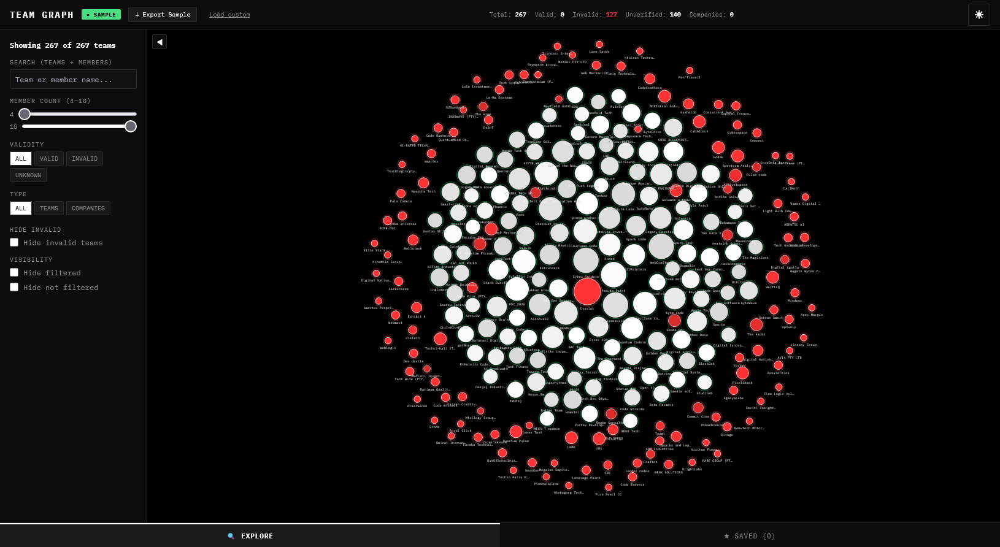
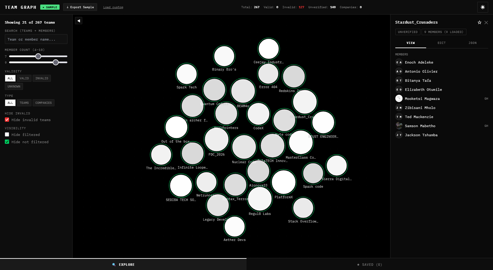
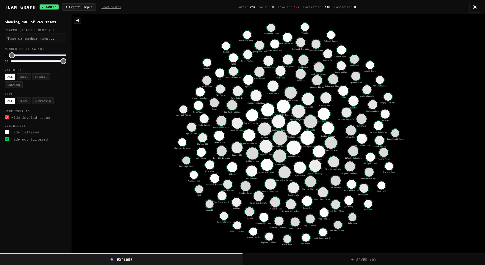
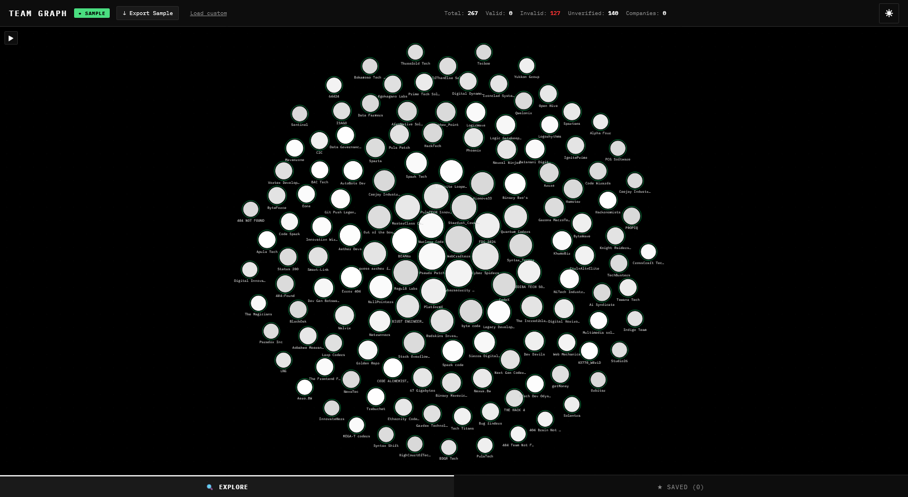

# Team Watch

A visual explorer and editor for team data scraped from the BOCRA Hackathon registration site. Built with React, D3.js, TypeScript, and Vite.



## Background

While browsing the BOCRA Hackathon site on SkillsRanker, I noticed that every registered team was rendered using an identical HTML structure — each team sat inside a `<div class="row">` with `col-md-6` columns, following the exact same card layout. The markup was completely uniform: team name, member table, avatar images, profile links — all in the same predictable DOM structure.

This consistency made it trivially scrapeable. I wrote a browser console script (`scripts/scrape.js`) that walks the DOM, extracts every team's name, members, profile URLs, GitHub avatars, and IDs, then dumps the entire dataset as JSON to the clipboard. The result is `sample.json` — a complete snapshot of every team registered on the site.

With the raw data in hand, I built **Team Watch** as both a **visualizer** and a **visual editor** on top of it — a way to explore the full hackathon roster at a glance, filter and search through teams, validate member counts, and annotate teams with metadata like validity and company status.

## Features

### Graph Visualization
- **Force-directed layout** powered by D3 — nodes repel, collide, and orbit radially by member count.
- **Dual renderer**: SVG for ≤300 nodes (interactive DOM elements), Canvas for >300 nodes (performant pixel rendering).
- **Zoom & pan** with mouse wheel / drag.
- **Dot grid background** for spatial reference.

### Node Encoding
| Visual | Meaning |
|---|---|
| **Circle** | Team |
| **Diamond (rhombus)** | Company |
| **Red fill** | Member count outside the valid range (not 4–10) |
| **Red stroke ring** | Invalid team (takes priority over other rings) |
| **Green stroke ring** | Passes current filter criteria |
| **Dashed ring** | Unverified validity (`isValid === null`) |
| **Pulsing glow** | Member name matches search query |
| **★ above node** | Bookmarked |

### Filtering (Sidebar)

The sidebar provides a full suite of filter controls to narrow down and explore the dataset.



- **Search** — matches team names and individual member names.
- **Member count range** — slider for min/max (4–10 valid range).
- **Validity filter** — all / valid / invalid / unknown.
- **Type filter** — all / teams / companies.
- **Hide invalid** — removes invalid teams from the graph.
- **Hide filtered** — hides nodes that *match* the current filter criteria.
- **Hide not filtered** — hides nodes that *don't match* the current filter criteria (isolates your results).

Below is an example of the graph with active filters and the sidebar open:



### Hiding Invalid Teams

Toggle **Hide invalid** to remove all teams marked as invalid from the graph, leaving only valid and unknown teams visible.



### Detail Panel
Click any node to open a slide-in panel with three tabs:
- **View** — member list with avatars, profile links, GitHub links, and company details.
- **Edit** — modify team name, member count, validity, company status, and company details. Changes are applied live and persisted to localStorage.
- **JSON** — raw JSON view with copy-to-clipboard.

### Bookmarks
- Star any team to save it. Switch to the **Saved** tab (bottom nav) to see only bookmarked teams.
- Bookmarks persist across sessions via localStorage.

### Data Management
- **Sample data** — ships with the scraped `sample.json` dataset from the BOCRA Hackathon site.
- **Load custom JSON** — import your own team data file (must be an array of `TeamData` objects).
- **Export** — download the current working dataset as JSON.
- **Reset to sample** — discard edits and revert to the original scraped data.
- Data source indicator in the top bar shows whether you're viewing sample or custom data.

### Theming
- Dark mode (default) and light mode toggle in the top bar.
- All colors use CSS custom properties for consistent theming.

## Scraper

`scripts/scrape.js` is a browser console script purpose-built for the BOCRA Hackathon site on SkillsRanker. The site renders every team inside a uniform card layout:

```html
<div class="row">
  <div class="col-md-6">
    <div class="card">
      <p class="font-weight-bolder">Team Name</p>
      <table>
        <tbody>
          <tr><!-- member row with avatar, name, profile link --></tr>
        </tbody>
      </table>
    </div>
  </div>
</div>
```

The script iterates over every `.row .col-md-6` column, extracts the team name from the card header, then walks each `<tbody tr>` to pull member names, profile URLs, avatar images, initials, and GitHub user IDs (parsed from `avatars.githubusercontent.com` URLs). The result is copied to the clipboard as a JSON array.

### Usage

1. Open the BOCRA Hackathon teams page in your browser.
2. Open the browser console (F12 → Console).
3. Paste the contents of `scripts/scrape.js` and press Enter.
4. The scraped JSON is copied to your clipboard and logged to the console.

## Data Format

The app expects a JSON array of objects matching this schema:

```json
{
  "teamName": "string",
  "memberCount": 4,
  "isValid": true | false | null,
  "isCompany": true | false | null,
  "companyDetails": {
    "facebook": "https://..." | null,
    "website": "https://..." | null
  } | null,
  "members": [
    {
      "name": "string",
      "profileUrl": "https://...",
      "initials": "AB" | null,
      "githubId": "12345" | null,
      "picture": "https://..." | null
    }
  ]
}
```

### Validity Rules
- Teams with `memberCount` outside 4–10 are automatically marked invalid.
- Within range, validity can be manually set to valid, invalid, or unknown.

## Tech Stack

- **React 18** + **TypeScript**
- **D3.js v7** — force simulation, zoom, SVG/Canvas rendering
- **Vite** — dev server and bundler
- **Tailwind CSS** — utility classes and design system tokens
- **IBM Plex Mono** — monospace font throughout the UI

## Project Structure

```
src/
├── components/team-graph/
│   ├── TeamGraph.tsx        # Main orchestrator — state, filters, data management
│   ├── GraphRenderer.tsx    # D3 force graph (SVG + Canvas dual renderer)
│   ├── Sidebar.tsx          # Filter controls and saved teams list
│   ├── DetailPanel.tsx      # Slide-in panel (view/edit/json tabs)
│   ├── TopBar.tsx           # Header bar — stats, export, theme toggle
│   ├── BottomNav.tsx        # Explore / Saved tab switcher
│   ├── MiniTooltip.tsx      # Hover tooltip showing member names
│   ├── EmptyStates.tsx      # Loading and no-results overlays
│   ├── sampleData.ts        # Loads bundled sample.json
│   └── types.ts             # TypeScript interfaces and type definitions
├── data/
│   └── sample.json          # Scraped dataset from the BOCRA Hackathon site
├── pages/
│   └── Index.tsx            # Root page — renders TeamGraph
└── index.css                # CSS variables / design tokens (dark + light themes)
pictures/
├── graph-overview.png       # Full graph with all teams visible
├── sidebar-filters.png      # Sidebar filter controls
├── filtered-with-sidebar.png # Graph with active filters applied
└── hidden-invalid-teams.png # Graph after hiding invalid teams
scripts/
└── scrape.js                # Browser console scraper for the BOCRA Hackathon site
```

## Getting Started

```bash
npm install
npm run dev
```

Open the preview to explore the scraped hackathon dataset. Use the sidebar to filter teams, click nodes to inspect members, and export your annotated data as JSON.
